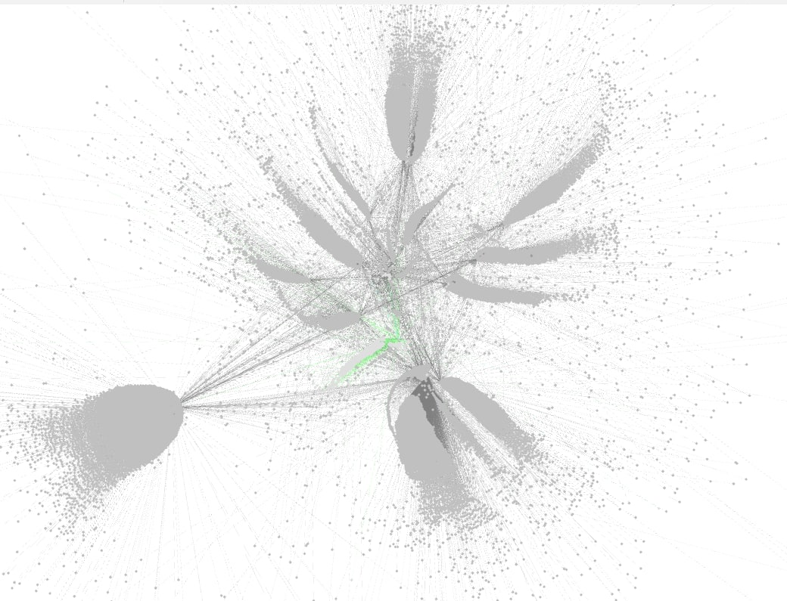

# Bitcoin Blockchain Vizualizer

Track all blockchain transactions recursively from a given address and discover BTC networks, usable with [Gephi.org](https://gephi.org/) project

*The first generated graph using this project, thanks to Gephi*

## Installation & Usage

Installation process is very simple:
1. Clone this repo using `git clone https://gitlab.com/Vanilor/btc-grapher` or download the .zip of the project
2. Open index.html in your file explorer
3. Paste the BTC address you want to track
4. Download the `all.csv` file generated
5. Import the CSV to Gephi using `File` => `Import Spreadsheet` and use the following settings: `Separator: Comma`, `Import as: Edges table`, `Charset: UTF-8`
6. Enjoy

## Disclaimer

All data comes from [blockchain.info]() public API endpoint. **NO API KEY IS NEEDED** (at least, at August 15th of 2022). Data are scrapped using a regular AJAX request. This service might be unavailable one day and I cannot do nothing about it.

## Why

Search for link across the blockchain to identify transactions performed by a given address, when and from/to. I didn't find the software I wanted to for my use case so I wrote my own one.

The first version of this project was initially created to spot a scammer network, display all links related to a given wallet and put them in Gephi to investigate between wallets and relationships. I choose Gephi as it's the first software I found capable to handle a graph with more than 100.000+ nodes and edges.

## How

The project search for all transactions of the input address using [blockchain.info]() API, put all linked wallets into a queue, then iterates over this queue to scrap recursively the transactions done by all those wallets, and so on. 

The generated graph could easily contains thousand of nodes, so be free to stop the generation at any moment and click on `GET CSV` button to get the current output.

## Contact me

Find me on Twitter: [@VanilorDev](https://twitter.com/VanilorDev) or on my [website](https://vanilor.net) (which will be up one day).